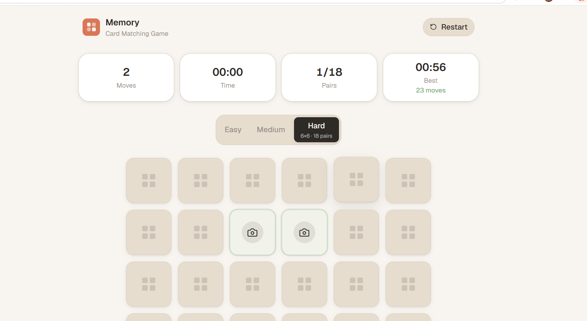
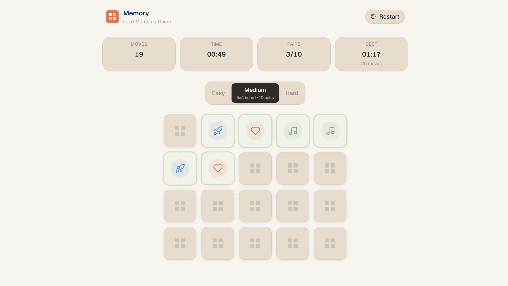
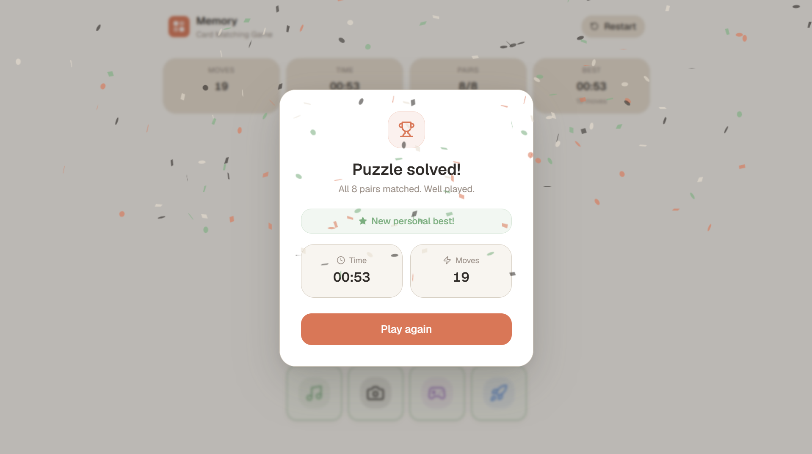

# Memory — Card Matching Game

A production-quality memory card matching game built with React, Tailwind CSS, and Framer Motion.

## 📸 Screenshots

### Home



### Gameplay



### Win Screen



---

## Features

- **4×4 grid** — 16 cards, 8 matching pairs
- **3 difficulty levels** — Easy (4×4), Medium (4×5), Hard (6×6)
- **Live stats** — move counter, timer, matched pairs
- **Personal bests** — stored per difficulty in Local Storage
- **Victory modal** — completion time, total moves, new best indicator + confetti
- **Smooth animations** — CSS 3D card flips, Framer Motion transitions
- **Keyboard accessible** — full keyboard navigation
- **Responsive** — mobile, tablet, and desktop

## Tech Stack

| Tool | Purpose |
|------|---------|
| React 18 | UI Framework |
| Vite | Build Tool |
| Tailwind CSS | Styling |
| Framer Motion | Animations |
| Lucide React | Icons |
| Canvas Confetti | Win Celebration |

## Getting Started

```bash
npm install
npm run dev
```

## Project Structure

```text
src/
├── components/
├── hooks/
├── utils/
├── constants/
├── data/
└── styles/
```

## Design Principles

- Warm earthy color palette
- No gradients or glassmorphism
- Clean editorial layout
- Responsive-first design
- Accessible interactions
- Smooth, subtle animations
